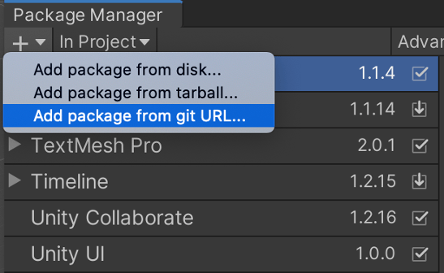

# Vuforia Engine Package for Unity

*Copyright (c) 2010-2021 PTC Inc.
All Rights Reserved.*

Vuforia Engine is the most widely used platform for AR development, with support for leading phones, tablets, and eyewear. Developers can easily add advanced computer vision functionality to Android, iOS, and UWP apps, to create AR experiences that realistically interact with objects and the environment.

To learn more about Vuforia Engine, visit [https://library.vuforia.com/articles/Training/getting-started-with-vuforia-in-unity.html](https://library.vuforia.com/articles/Training/getting-started-with-vuforia-in-unity.html)  
To view the Vuforia Developer Agreement, go to: [https://developer.vuforia.com/legal/vuforia-developer-agreement](https://developer.vuforia.com/legal/vuforia-developer-agreement)  
To view the release notes, go to: [https://library.vuforia.com/articles/Release\_Notes.html](https://library.vuforia.com/articles/Release_Notes.html)


## Using this package

To make this package available to the Unity package manager it needs to be added from a git URL. This can be done by importing the Unity editor script available here: [developer.vuforia.com/downloads/sdk](https://developer.vuforia.com/downloads/sdk) 

Alternatively, it can be added directly from the Package Manager Window through the + icon in the upper left. Select “Add package from git URL”:



The URL to add is
```json
git+https://git-packages.developer.vuforia.com/#9.8.8
```
where the number after # represents the Vuforia Engine version you wish to import.
Note: There is no visual feedback in the Unity Editor while the package is being imported in the background.

Finally, you can directly add the dependency to your project by editing the *manifest.json* in your project’s *Packages* folder, adding an entry for “dependencies” with a # tag for the version you wish to import:
```json
{
   "dependencies": { 
"com.ptc.vuforia.engine": "git+https://git-packages.developer.vuforia.com/#9.8.8,
	...
  } 
} 
```
Once the dependency has been added with the specified version of the Vuforia Engine, the package will be available in the Unity Package Manager UI.